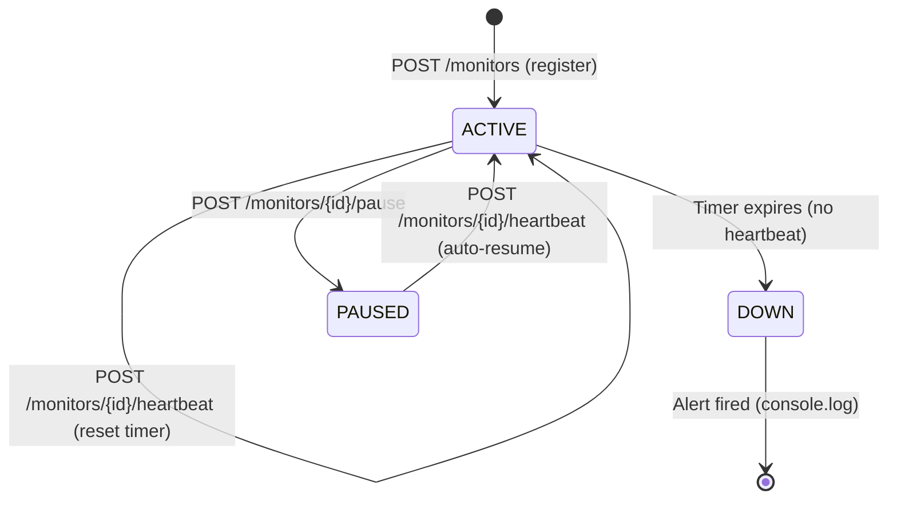
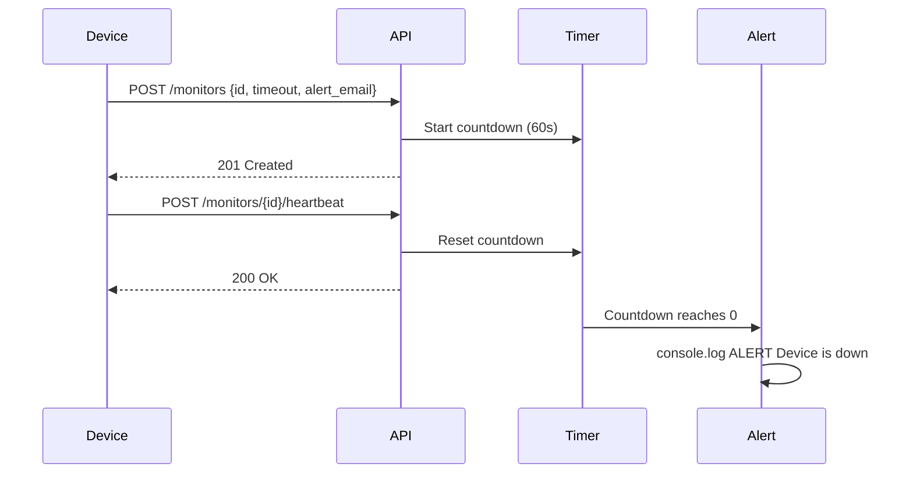

# Pulse-Check-API (Watchdog Sentinel)

A Dead Man's Switch API for monitoring remote devices at CritMon Servers Inc.

---

## Architecture Diagram

### State Flowchart

```mermaid
stateDiagram-v2
    [*] --> ACTIVE : POST /monitors (register)
    ACTIVE --> ACTIVE : POST /monitors/{id}/heartbeat (reset timer)
    ACTIVE --> DOWN : Timer expires (no heartbeat)
    ACTIVE --> PAUSED : POST /monitors/{id}/pause
    PAUSED --> ACTIVE : POST /monitors/{id}/heartbeat (auto-resume)
    DOWN --> [*] : Alert fired (console.log)
```

### Sequence Diagram

```mermaid
sequenceDiagram
    participant Device
    participant API
    participant Timer
    participant Alert

    Device->>API: POST /monitors {id, timeout, alert_email}
    API->>Timer: Start countdown (60s)
    API-->>Device: 201 Created

    Device->>API: POST /monitors/{id}/heartbeat
    API->>Timer: Reset countdown
    API-->>Device: 200 OK

    Timer->>Alert: Countdown reaches 0
    Alert->>Alert: console.log ALERT Device is down
```